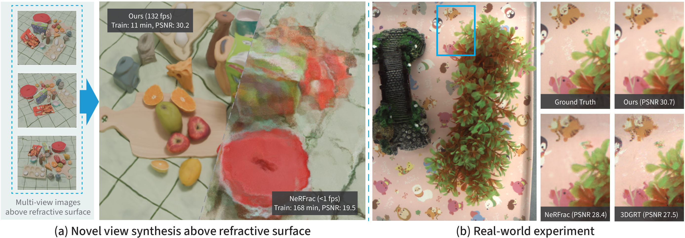

# RefracGS: Novel View Synthesis Through Refractive Water Surfaces with 3D Gaussian Ray Tracing
Yiming Shao, Qiyu Dai, Chong Gao, Guanbin Li, Yequan Wang, He Sun, Qiong Zeng, Baoquan Chen, Wenzheng Chen

### [Project Page](https://yimgshao.github.io/refracgs/) | [arXiv](https://arxiv.org/abs/2603.21695) | [Dataset](https://huggingface.co/datasets/yimingshao1/refracgs_dataset)


We present RefracGS, a through-refraction novel view synthesis framework with refraction-aware 3D Gaussian ray tracing. It achieves state-of-the-art visual quality while maintaining 15x faster training and real-time 200 FPS rendering.

## News
- [2026.07.19]: We release our source code and dataset.
- [2026.06.18]: Our paper was accepted by ECCV'26.


## 1. Dependencies and Installation
- CUDA Toolkit 11.8 or higher. (with nvcc)
- NVIDIA GPU with 24GB+ VRAM and Ray Tracing (RT) cores (e.g., RTX 4090 or higher).
- Currently, only Linux environments are supported.

First, clone the repository and create conda environment:
```bash
# Clone the repository from github.com
git clone https://github.com/yimgshao/refracgs.git
cd refracgs

# Create conda environment
conda create -n refracgs python=3.12
conda activate refracgs
```

Then, install dependencies:
```bash
# Install torch (need to match your cuda-toolkit version)
pip3 install torch torchvision --index-url https://download.pytorch.org/whl/cu118

# Install dependencies in requirements.txt
pip install -r requirements.txt

# Install fused-ssim
pip install git+https://github.com/rahul-goel/fused-ssim@1272e21a282342e89537159e4bad508b19b34157 --no-build-isolation

# Install the refracgs package
pip install -e .
```

## 2. Datasets Preparation
### NeRFrac dataset
Download NeRFrac dataset (LLFF format) from [here](https://github.com/Yifever20002/NeRFrac), and then convert it from LLFF format to NeRF/Blender format:
```bash
# Convert single scene
python scripts/llff2blender.py -i <llff-scene> -o <output-path>

# Example:
python scripts/llff2blender.py -i data/nerfrac_llff/real_plant -o data/nerfrac/real_plant

# Convert every scene subdirectory
python scripts/llff2blender.py -i <llff-root> -o <output-root> --batch 

# Example:
python scripts/llff2blender.py -i data/nerfrac_llff -o data/nerfrac --batch
```

### RefracGS dataset
You can download RefracGS dataset from [here](https://huggingface.co/datasets/yimingshao1/refracgs_dataset). The dataset is already in NeRF/Blender format.

## 3. Training
Training on NeRFrac dataset:
```bash
# NeRFrac real dataset:
CUDA_VISIBLE_DEVICES=<gpu> python train.py --config-name apps/nerfrac_real.yaml path=<dataset-path> out_dir=<output-dir> experiment_name=<exp-name>

# NeRFrac synthetic dataset:
CUDA_VISIBLE_DEVICES=<gpu> python train.py --config-name apps/nerfrac_synthetic.yaml path=<dataset-path> out_dir=<output-dir> experiment_name=<exp-name>

# Example:
CUDA_VISIBLE_DEVICES=0 python train.py --config-name apps/nerfrac_real.yaml path=data/nerfrac/real_plant out_dir=runs experiment_name=real_plant

CUDA_VISIBLE_DEVICES=0 python train.py --config-name apps/nerfrac_synthetic.yaml path=data/nerfrac/syn_primary_sine out_dir=runs experiment_name=syn_primary_sine
```
Training on RefracGS dataset:
```bash
# Training on 30-view scene:
CUDA_VISIBLE_DEVICES=<gpu> python train.py --config-name apps/refracgs_synthetic_30view.yaml path=<dataset-path> out_dir=<output-dir> experiment_name=<exp-name>

# Training on 9-view scene:
CUDA_VISIBLE_DEVICES=<gpu> python train.py --config-name apps/refracgs_synthetic_9view.yaml path=<dataset-path> out_dir=<output-dir> experiment_name=<exp-name>

# Example:
CUDA_VISIBLE_DEVICES=0 python train.py --config-name apps/refracgs_synthetic_30view.yaml path=data/refracgs_synthetic/kitchen_30view out_dir=runs experiment_name=kitchen_30view

CUDA_VISIBLE_DEVICES=0 python train.py --config-name apps/refracgs_synthetic_9view.yaml path=data/refracgs_synthetic_supp/kitchen_9view out_dir=runs experiment_name=kitchen_9view

```

## 4. Rendering
Get rendering results from pre-trained checkpoints.
```bash
# Rendering
CUDA_VISIBLE_DEVICES=<gpu> python render.py --checkpoint <checkpoint> --out-dir <output-dir>

# Example:
CUDA_VISIBLE_DEVICES=0 python render.py --checkpoint runs/real_plant/real_plant-xxxx_xxxxxx/ckpt_last.pt --out-dir outputs
```

## 5. Citations
```bash
@inproceedings{shao2026refracgs,
    title     = {RefracGS: Novel View Synthesis Through Refractive Water Surfaces with 3D Gaussian Ray Tracing},
    author    = {Shao, Yiming and Dai, Qiyu and Gao, Chong and Li, Guanbin and Wang, Yequan and Sun, He and Zeng, Qiong and Chen, Baoquan and Chen, Wenzheng},
    booktitle = {Proceedings of the European Conference on Computer Vision (ECCV)},
    year      = {2026}
}
```

## 6. Acknowledgements
Special thanks to the [NVIDIA 3DGRUT project](https://github.com/nv-tlabs/3dgrut) for providing their open-source codebase, and the [NeRFrac](https://github.com/Yifever20002/NeRFrac) authors for their public dataset. We also want to thank Ashley ([@Ashleyyyyy663](https://github.com/Ashleyyyyy663)) for helping us prepare the RefracGS dataset and set up the project webpage.
